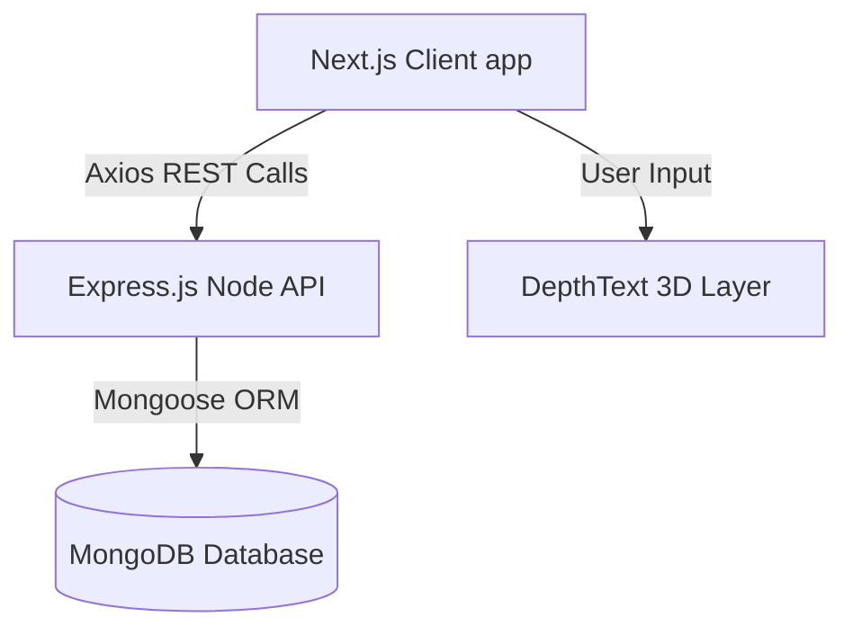
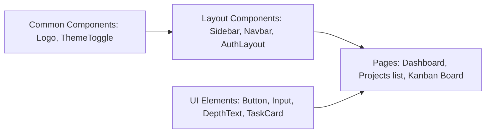
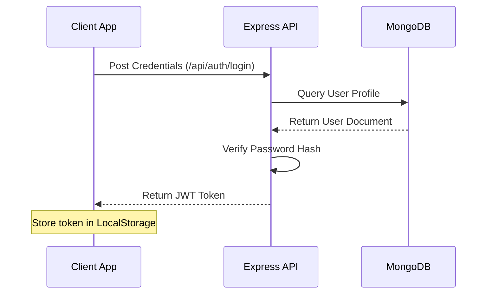
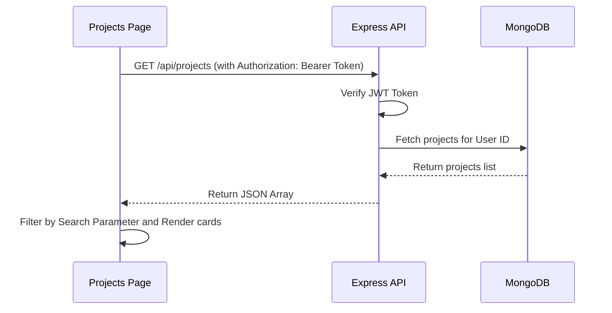

# High-Level Design (HLD) - DevTrack AI

## 1. System Architecture
DevTrack AI is structured as a modern Web application using a decoupled Client-Server architecture:

- **Frontend Application**: Client-side single-page application built on Next.js 15 using App Router and Client-side state.
- **Backend Service**: REST API built with Node.js and Express, exposing endpoints for authentication, project management, and task scheduling.
- **Database Layer**: MongoDB Document Database representing projects, tasks, and users.

---

## 2. Tech Stack
- **Frontend Framework**: Next.js 15 (React 19)
- **Styling**: Tailwind CSS
- **HTTP Client**: Axios (client-to-server calls)
- **Icons**: Lucide React
- **Backend Framework**: Node.js + Express.js
- **Database ORM**: Mongoose / MongoDB
- **Security**: JSON Web Tokens (JWT) + BCrypt (password hashing)
- **Deployment**: Vercel (Frontend), Render (Backend / MongoDB Cloud Atlas)

---

## 3. Component Architecture
The frontend components are categorized into:

### 3.1 Core Components
- **Sidebar**: Sticky left panel managing workspace directory navigation. Responsive to width states (expanded vs. collapsed).
- **Navbar**: Top contextual header hosting search, theme controls, and user profile menus.
- **TaskCard / ProjectCard**: Reusable containers showing database resource metadata.
- **DepthText**: 3D extruded text layout supporting gyroscope/cursor mouse interactions.

---

## 4. Key Data Flows

### 4.1 Authentication Flow

### 4.2 Projects and Tasks Query Flow

---

## 5. Security Architecture
1. **Password Hashing**: Stored passwords are cryptographically hashed using salt factors with BCrypt.
2. **API Protection**: Private resources require requests to contain valid JSON Web Tokens in the `Authorization` header.
3. **Route Guards**: Client-side routers automatically check token validity and redirect unauthenticated sessions to `/login`.
